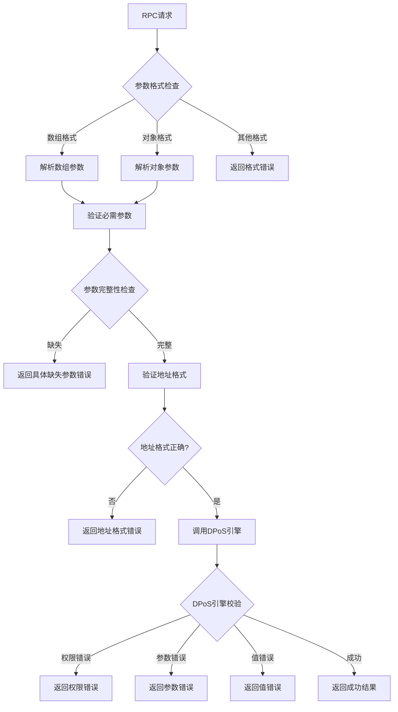

# 参数提案错误处理优化方案

## 问题分析

原始问题：创建参数提案时，RPC接口返回通用的 `"invalid parameters format"` 错误，无法提供具体的错误信息，如：
- 参数地址错误
- 参数格式不对
- 地址不是验证者地址
- 参数范围不对

## 解决方案

### 1. 支持多种参数格式

修改 `CreateParameterProposal` RPC接口，支持两种参数格式：

#### 数组格式（命令行使用）
```json
{
  "jsonrpc": "2.0",
  "method": "dpos_createParameterProposal",
  "params": [
    "dpos_validator_reward_ratio",
    80,
    "提高验证者奖励比例到80%",
    "0x1234567890abcdef"
  ],
  "id": 1
}
```

#### 对象格式（更灵活）
```json
{
  "jsonrpc": "2.0",
  "method": "dpos_createParameterProposal",
  "params": {
    "parameter": "dpos_validator_reward_ratio",
    "newValue": 80,
    "description": "提高验证者奖励比例到80%",
    "proposer": "0x1234567890abcdef"
  },
  "id": 1
}
```

### 2. 详细的错误信息

#### RPC层错误处理
- **参数格式错误**：`"invalid parameters format: expected array or object, got %T"`
- **参数数量错误**：`"invalid parameters: expected 4 parameters [parameter, newValue, description, proposer], got %d"`
- **参数类型错误**：`"invalid parameter name: expected string, got %T"`
- **空值检查**：`"proposer address cannot be empty"`
- **地址格式错误**：`"invalid proposer address format: %s"`

#### DPoS引擎层错误处理
- **权限错误**：`"permission denied: address %s is not a validator"`
- **参数无效**：`"invalid parameter: %s is not a votable parameter"`
- **值无效**：`"invalid parameter value: %v for parameter %s"`
- **范围错误**：`"parameter value out of range: %v for parameter %s"`
- **类型错误**：`"invalid parameter type: expected valid type for parameter %s"`

### 3. 错误处理流程



### 4. 修改的文件

#### `jsonrpc/dpos_endpoint.go`
- 添加 `strings` 包导入
- 修改 `CreateParameterProposal` 方法支持两种参数格式
- 添加详细的错误信息处理
- 增强地址格式验证

### 5. 错误信息示例

#### 成功响应
```json
{
  "jsonrpc": "2.0",
  "id": 1,
  "result": {
    "success": true,
    "proposalId": "proposal_001",
    "parameter": "dpos_validator_reward_ratio",
    "oldValue": 70,
    "newValue": 80,
    "proposer": "0x1234567890abcdef",
    "startBlock": 1001,
    "endBlock": 1100,
    "status": "pending",
    "threshold": 51,
    "description": "提高验证者奖励比例到80%",
    "createdAt": 1695123456,
    "message": "Parameter proposal created successfully"
  }
}
```

#### 错误响应示例

**权限错误**：
```json
{
  "jsonrpc": "2.0",
  "id": 1,
  "error": {
    "code": -32600,
    "message": "permission denied: address 0x1234567890abcdef is not a validator"
  }
}
```

**参数范围错误**：
```json
{
  "jsonrpc": "2.0",
  "id": 1,
  "error": {
    "code": -32600,
    "message": "parameter value out of range: 150 for parameter dpos_validator_reward_ratio"
  }
}
```

**参数格式错误**：
```json
{
  "jsonrpc": "2.0",
  "id": 1,
  "error": {
    "code": -32600,
    "message": "invalid parameters: expected 4 parameters [parameter, newValue, description, proposer], got 3"
  }
}
```

### 6. 使用示例

#### 命令行调用
```bash
# 正确的调用
./main dpos proposal create-proposal \
  --parameter "dpos_validator_reward_ratio" \
  --new-value "80" \
  --description "提高验证者奖励比例到80%" \
  --proposer "0x5d1F45B8D5a5eC9c3BEb91cAEbA6a3180DBeC7A9"

# 错误示例1：非验证者地址
./main dpos proposal create-proposal \
  --parameter "dpos_validator_reward_ratio" \
  --new-value "80" \
  --description "测试" \
  --proposer "0x1234567890abcdef"
# 返回：permission denied: address 0x1234567890abcdef is not a validator

# 错误示例2：参数值超出范围
./main dpos proposal create-proposal \
  --parameter "dpos_validator_reward_ratio" \
  --new-value "150" \
  --description "测试" \
  --proposer "0x5d1F45B8D5a5eC9c3BEb91cAEbA6a3180DBeC7A9"
# 返回：parameter value out of range: 150 for parameter dpos_validator_reward_ratio
```

#### 直接RPC调用
```bash
# 数组格式
curl -X POST http://localhost:8545 \
  -H "Content-Type: application/json" \
  -d '{
    "jsonrpc": "2.0",
    "method": "dpos_createParameterProposal",
    "params": [
      "dpos_validator_reward_ratio",
      80,
      "提高验证者奖励比例到80%",
      "0x5d1F45B8D5a5eC9c3BEb91cAEbA6a3180DBeC7A9"
    ],
    "id": 1
  }'

# 对象格式
curl -X POST http://localhost:8545 \
  -H "Content-Type: application/json" \
  -d '{
    "jsonrpc": "2.0",
    "method": "dpos_createParameterProposal",
    "params": {
      "parameter": "dpos_validator_reward_ratio",
      "newValue": 80,
      "description": "提高验证者奖励比例到80%",
      "proposer": "0x5d1F45B8D5a5eC9c3BEb91cAEbA6a3180DBeC7A9"
    },
    "id": 1
  }'
```

## 总结

通过这次优化，创建参数提案的RPC接口现在能够：

1. **支持多种参数格式**：数组格式和对象格式
2. **提供详细的错误信息**：明确指出具体的错误原因
3. **增强参数验证**：从RPC层到DPoS引擎层的完整校验
4. **改善用户体验**：用户能够快速定位和解决问题

这样的错误处理机制大大提升了系统的可用性和调试效率。
